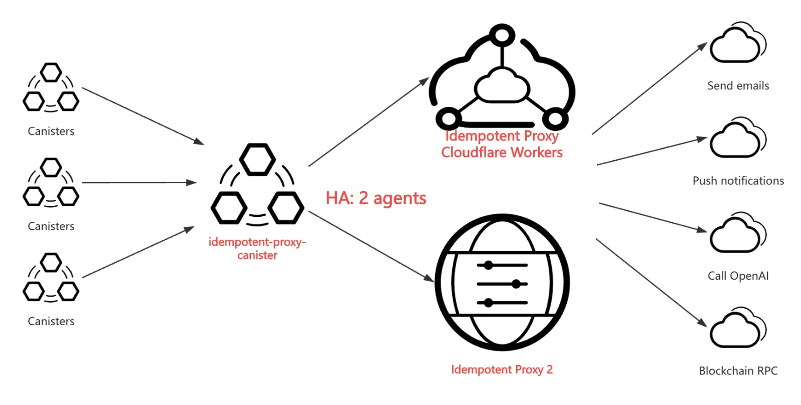

# `idempotent-proxy-canister`

The `idempotent-proxy-canister` is an ICP smart contract that can connect to 1 to N Idempotent Proxy services deployed by `idempotent-proxy-server` or `idempotent-proxy-cf-worker`. It provides on-chain HTTPS outcalls with idempotency for other smart contracts.

The `idempotent-proxy-canister` automatically updates the proxy token periodically and offers the following three proxy interfaces to accommodate different business scenarios:

1. `proxy_http_request`: Prioritizes the first agent. If it fails (status code > 500), it attempts the next agent until it succeeds.
2. `parallel_call_any_ok`: Calls all agents in parallel. If any one succeeds, it returns the successful result; otherwise, it returns the last failed result.
3. `parallel_call_all_ok`: Calls all agents in parallel. Only returns a successful result if all agents succeed and the results are identical; otherwise, it returns a 500 error with an array of all results.

Note: If only one agent is configured, all three interfaces are equivalent.



## Online Demo

idempotent-proxy-canister: https://a4gq6-oaaaa-aaaab-qaa4q-cai.raw.icp0.io/?id=hpudd-yqaaa-aaaap-ahnbq-cai

## Running the project locally

If you want to test your project locally, you can use the following commands:

```bash
# Starts the replica, running in the background
dfx start --background

# deploy the canister
dfx deploy idempotent-proxy-canister --argument "(opt variant {Init =
  record {
    ecdsa_key_name = \"dfx_test_key\";
    proxy_token_refresh_interval = 3600;
  }
})"

dfx canister call idempotent-proxy-canister get_state '()'

# 3 same agents for testing
dfx canister call idempotent-proxy-canister admin_set_agents '
  (vec {
    record {
      name = "LDCLabs";
      endpoint = "https://idempotent-proxy-cf-worker.zensh.workers.dev";
      max_cycles = 100000000000;
      proxy_token = null;
    }; record {
      name = "LDCLabs";
      endpoint = "https://idempotent-proxy-cf-worker.zensh.workers.dev";
      max_cycles = 100000000000;
      proxy_token = null;
    }; record {
      name = "LDCLabs";
      endpoint = "https://idempotent-proxy-cf-worker.zensh.workers.dev";
      max_cycles = 100000000000;
      proxy_token = null;
    };
  })
'

MYID=$(dfx identity get-principal)

dfx canister call idempotent-proxy-canister admin_add_caller "(principal \"$MYID\")"

dfx canister call idempotent-proxy-canister get_state '()'

# URL_HTTPBIN == "https://httpbin.org/get?api-key=abc123"
dfx canister call idempotent-proxy-canister proxy_http_request "(record {
  url = \"URL_HTTPBIN\";
  method = variant{ \"get\" };
  max_response_bytes = null;
  body = null;
  transform = null;
  headers = vec {
    record { name = \"idempotency-key\"; value = \"idempotency_key_001\"; };
  };
})"

dfx canister call idempotent-proxy-canister parallel_call_any_ok "(record {
  url = \"https://httpbin.org/get?api-key=abc123\";
  method = variant{ \"get\" };
  max_response_bytes = null;
  body = null;
  transform = null;
  headers = vec {
    record { name = \"idempotency-key\"; value = \"idempotency_key_001\"; };
  };
})"

dfx canister call idempotent-proxy-canister parallel_call_all_ok "(record {
  url = \"URL_HTTPBIN\";
  method = variant{ \"get\" };
  max_response_bytes = null;
  body = null;
  transform = null;
  headers = vec {
    record { name = \"idempotency-key\"; value = \"idempotency_key_001\"; };
  };
})"

```

`idempotent-proxy-cf-worker` does not enable `proxy-authorization`, so it can be accessed.

## License
Copyright © 2024 [LDC Labs](https://github.com/ldclabs).

`ldclabs/idempotent-proxy` is licensed under the MIT License. See [LICENSE](../../LICENSE-MIT) for the full license text.