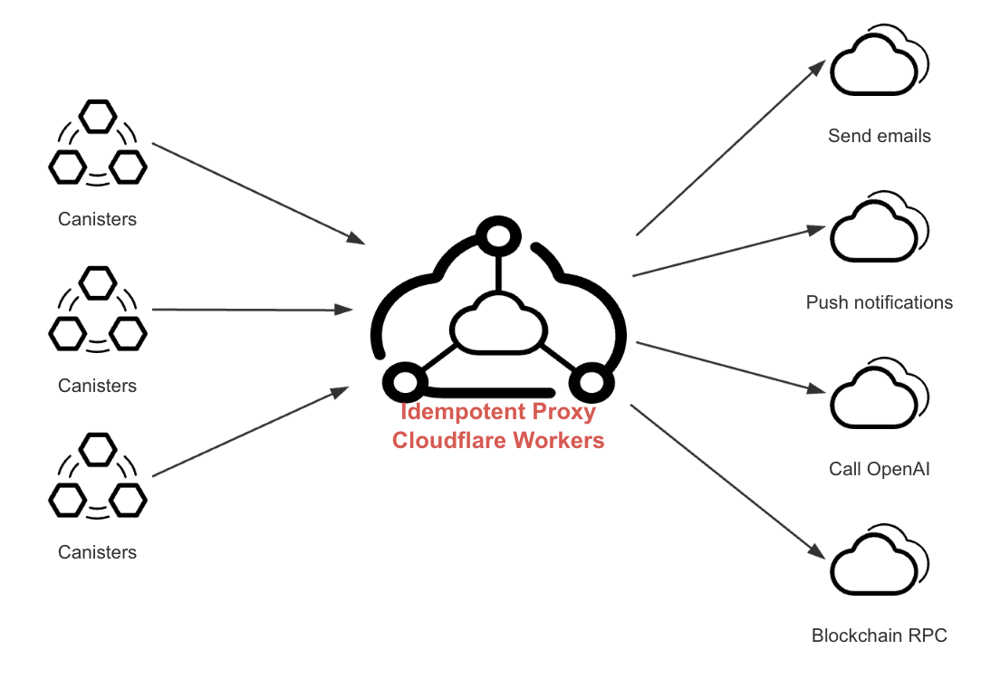

# idempotent-proxy-cf-worker
Reverse proxy server with build-in idempotency support running as a Cloudflare Worker.

## Overview

The idempotent-proxy is a reverse proxy service with built-in idempotency support that running as a Cloudflare Worker.

When multiple requests with the same idempotency-key arrive within a specific timeframe, only the first request is forwarded to the target service. The response is cached in Durable Object, and subsequent requests poll the Durable Object to retrieve and return the first request's response.

This service can be used to proxy [HTTPS outcalls](https://internetcomputer.org/docs/current/developer-docs/smart-contracts/advanced-features/https-outcalls/https-outcalls-overview) for [ICP canisters](https://internetcomputer.org/docs/current/developer-docs/smart-contracts/overview/introduction), enabling integration with any Web2 service. It supports returning only the necessary headers and, for JSON data, allows response filtering based on JSON Mask to return only required fields, thus saving cycles consumption in ICP canisters.



If you plan to use this project and have any questions, feel free to open an issue. I will address it as soon as possible.

## Run proxy in development mode

Run proxy:
```bash
npm i
npm run dev
```

## Proxy Request Example

See: https://github.com/ldclabs/idempotent-proxy